# 🔐 ANALISI SISTEMATICA DEL FLUSSO DI AUTENTICAZIONE REALE

**Data Analisi**: 2 Giugno 2025  
**Sistema**: Spring Microservices con Gateway Security  
**Architettura**: JWT Stateless Authentication + API Gateway Pattern

---

## 🏗️ ARCHITETTURA ATTUALE IDENTIFICATA

### 📊 **Servizi Realmente Implementati**
1. **🔐 AUTH-SERVICE** (Porta 8081) - Servizio di Autenticazione
2. **🌐 GATEWAY-SERVICE** (Porte 8080/8443) - API Gateway con Security
3. **💾 POSTGRES** (Porta 5432/15432) - Database Persistenza
4. **🔴 REDIS** (Porta 6379/16379) - Rate Limiting Cache

### 🚫 **Servizi NON Implementati**
- ❌ **Chat-Service**: Non presente nel sistema attuale
- ❌ **Movie-Service**: Riferimenti obsoleti nella documentazione

---

## 🔄 FLUSSO DI AUTENTICAZIONE REALE - ANALISI DETTAGLIATA

### **FASE 1: REGISTRAZIONE UTENTE** 

```mermaid
sequenceDiagram
    participant C as Client/Frontend
    participant G as Gateway (8080/8443)
    participant A as Auth-Service (8081)
    participant DB as PostgreSQL (5432)
    
    C->>G: POST /auth/register
    Note over G: ✅ Public Endpoint - No JWT Required
    G->>A: Forward Request
    A->>A: Validate UserRegistrationRequest
    A->>A: BCrypt Hash Password
    A->>DB: INSERT User (username, hashed_password, roles)
    DB-->>A: User Created
    A-->>G: UserResponse (no password)
    G-->>C: Registration Success
```


**📝 Implementazione Reale:**
```java
// AuthController.java - Endpoint Registrazione
@PostMapping("/register")
public ResponseEntity<?> registerUser(@Valid @RequestBody UserRegistrationRequest request) {
    // 1. Validazione input con @Valid
    // 2. Check username duplicato
    // 3. BCrypt password hashing
    // 4. Salvataggio in PostgreSQL
    // 5. Return UserResponse (no password)
}
```

### **FASE 2: LOGIN E GENERAZIONE JWT**

```mermaid
sequenceDiagram
    participant C as Client
    participant G as Gateway
    participant A as Auth-Service
    participant DB as PostgreSQL
    
    C->>G: POST /auth/login {username, password}
    Note over G: ✅ Public Endpoint
    G->>A: Forward Login Request
    A->>DB: SELECT user WHERE username=?
    DB-->>A: User Record
    A->>A: BCrypt.checkpw(password, stored_hash)
    Note over A: ✅ Password Validated
    A->>A: Generate JWT Token
    Note over A: JWT Claims: username, roles, exp, iss
    A-->>G: JwtResponse {token, username, roles, expires}
    G-->>C: Login Success + JWT Token
```


**📝 Implementazione Reale:**
```java
// AuthController.java - Login Endpoint
@PostMapping("/login")
public ResponseEntity<?> authenticateUser(@Valid @RequestBody LoginRequest loginRequest) {
    // 1. Validate credentials con AuthService
    boolean isValid = authService.validateUser(loginRequest.getUsername(), loginRequest.getPassword());
    
    // 2. Get user roles
    String roles = authService.getUserRoles(loginRequest.getUsername());
    
    // 3. Generate JWT token
    String jwt = jwtUtil.generateToken(loginRequest.getUsername(), roles, null);
    
    // 4. Return JwtResponse
    return ResponseEntity.ok(new JwtResponse(jwt, username, roles, expirationTime));
}
```

**🔐 JWT Token Generato:**
```java
// JwtUtil.java - Token Generation (SOLO AUTH-SERVICE)
public String generateToken(String username, String roles, Map<String, Object> claims) {
    Date now = new Date();
    Date expiryDate = new Date(now.getTime() + jwtExpirationMs); // 24h default
    
    return Jwts.builder()
        .setSubject(username)                    // Username
        .setIssuer("spring-microservices")       // Issuer
        .setIssuedAt(now)                       // Timestamp
        .setExpiration(expiryDate)              // Scadenza
        .claim("roles", roles)                  // User roles
        .signWith(getSigningKey(), HS256)       // HMAC256 signature
        .compact();
}
```

### **FASE 3: ACCESSO A RISORSA PROTETTA**


**📝 Implementazione Gateway Filter:**
```java
// JwtAuthenticationGatewayFilterFactory.java - CENTRALIZED SECURITY
@Override
public GatewayFilter apply(Config config) {
    return (exchange, chain) -> {
        // 1. Extract client info
        String path = request.getPath().value();
        String clientIP = getClientIP(request);
        
        // 2. Check if public endpoint
        if (isPublicEndpoint(path)) {
            securityLogger.info("PUBLIC ACCESS: {} from {}", path, clientIP);
            return chain.filter(exchange);
        }
        
        // 3. JWT VALIDATION (CENTRALIZED)
        String token = jwtUtil.extractTokenFromHeader(authHeader);
        if (!jwtUtil.validateToken(token)) {
            securityLogger.warn("AUTH FAILURE: Invalid JWT token for {} from {}", path, clientIP);
            return unauthorizedResponse(response, "Invalid JWT token");
        }
        
        // 4. Extract user claims
        String username = jwtUtil.extractUsername(token);
        String roles = jwtUtil.extractRoles(token);
        
        // 5. Forward TRUSTED HEADERS to downstream services
        ServerHttpRequest modifiedRequest = request.mutate()
            .header("X-User-Username", username)
            .header("X-User-Roles", roles)
            .header("X-Auth-Valid", "true")
            .header("X-Gateway-Validated", "true")
            .build();
            
        securityLogger.info("AUTH SUCCESS: User '{}' accessing {}", username, path);
        return chain.filter(exchange.mutate().request(modifiedRequest).build());
    };
}
```

### **FASE 4: VALIDAZIONE TOKEN (Endpoint Dedicato)**

```mermaid
sequenceDiagram
    participant S as Service/Client
    participant G as Gateway
    participant A as Auth-Service
    
    S->>G: POST /auth/validate {token: "JWT_TOKEN"}
    Note over G: ✅ Public Endpoint
    G->>A: Forward Validation Request
    A->>A: jwtUtil.validateToken(token)
    A->>A: Extract username from token
    
    alt Token Valid ✅
        A-->>G: {valid: true, username: "john"}
        G-->>S: Validation Success
    else Token Invalid ❌
        A-->>G: {valid: false, message: "Invalid token"}
        G-->>S: 401 Unauthorized
    end
```


---

## 🛡️ IMPLEMENTAZIONE SICUREZZA REALE

### **🔐 JWT Secret Management**
```properties
# application.properties - Environment-based secrets
jwt.secret=${JWT_SECRET:mySecretKey123456789012345678901234567890}
jwt.expiration-ms=${JWT_EXPIRATION_MS:86400000}  # 24 hours
jwt.issuer=${JWT_ISSUER:spring-microservices}
```

**✅ Security Best Practices Implementate:**
- Environment-based secret (no hardcoded)
- HMAC256 signature algorithm
- Token expiration (24h default)
- Issuer validation

### **🔒 Password Security**
```java
// SecurityConfig.java - BCrypt Configuration
@Bean
public PasswordEncoder passwordEncoder() {
    return new BCryptPasswordEncoder(12); // Strong work factor
}

// AuthService.java - Password Validation
public boolean validateUser(String username, String password) {
    User user = userRepository.findByUsername(username);
    return passwordEncoder.matches(password, user.getPassword());
}
```

### **🚦 Rate Limiting Protection**
```java
// RateLimitConfig.java - DDoS Protection
@Bean
@Primary
public RedisRateLimiter authRateLimiter() {
    return new RedisRateLimiter(
        5,    // 5 requests per second
        10,   // Burst capacity: 10
        1     // Tokens per request: 1
    );
}

@Bean
public KeyResolver ipKeyResolver() {
    return exchange -> {
        // Smart key resolution: User-based for authenticated, IP-based for anonymous
        String username = exchange.getRequest().getHeaders().getFirst("X-User-Username");
        return username != null 
            ? Mono.just("user:" + username)
            : Mono.just("ip:" + getClientIp(exchange));
    };
}
```

---

## 📊 ENDPOINTS DI SICUREZZA REALI

### **🔓 PUBLIC ENDPOINTS** (No JWT Required)
```java
// JwtAuthenticationGatewayFilterFactory.java
private boolean isPublicEndpoint(String path) {
    return path.startsWith("/auth/login") ||           // Login
           path.startsWith("/auth/register") ||        // Registration  
           path.startsWith("/auth/validate") ||        // Token validation
           path.startsWith("/auth/refresh") ||         // Token refresh
           path.startsWith("/actuator/health") ||      // Health checks
           path.equals("/") ||                         // Root
           path.startsWith("/swagger") ||              // API docs (dev)
           path.startsWith("/v3/api-docs");            // OpenAPI (dev)
}
```

### **🔒 PROTECTED ENDPOINTS** (JWT Required)
- `/api/**` - Future microservices APIs
- `/auth/profile` - User profile management  
- `/auth/users/**` - User management (ADMIN only)
- Tutti gli altri endpoint non pubblici

---

## 🔍 SECURITY AUDIT LOGGING REALE

### **📋 Log Patterns Implementati**
```java
// Real logging implementation in Gateway
securityLogger.info("AUTH SUCCESS: User '{}' with roles '{}' accessing {} {} from {}", 
    username, roles, method, path, clientIP);

securityLogger.warn("AUTH FAILURE: Invalid JWT token for {} {} from {}", 
    method, path, clientIP);

securityLogger.info("PUBLIC ACCESS: {} {} from {} - No authentication required", 
    method, path, clientIP);
```

**📁 Log Files:**
- `gateway/initial/logs/gateway-security.log` - Security audit trail
- `auth-service/logs/security.log` - Authentication events
- Console output per development

---

## 🚀 DEPLOYMENT CONFIGURATION REALE

### **🐳 Docker Compose Staging**
```yaml
# docker-compose.staging.yml - Production-like setup
services:
  postgres:
    image: postgres:15
    ports: ["15432:5432"]
    environment:
      POSTGRES_PASSWORD: ${POSTGRES_PASSWORD}
      
  redis:
    image: redis:7-alpine  
    ports: ["16379:6379"]
    
  auth-service:
    build: ./auth-service
    ports: ["9081:8080"]
    environment:
      JWT_SECRET: ${JWT_SECRET}
      SPRING_DATASOURCE_URL: jdbc:postgresql://postgres:5432/mydb
      
  gateway:
    build: ./gateway/initial
    ports: 
      - "9080:8080"   # HTTP Management
      - "9443:8443"   # HTTPS Main
    environment:
      JWT_SECRET: ${JWT_SECRET}
      REDIS_HOST: redis
    depends_on: [auth-service, redis]
```

---

## ⚠️ IDENTIFICAZIONE PROBLEMI E RACCOMANDAZIONI

### **❌ PROBLEMI CRITICI IDENTIFICATI**

#### 1. **Architettura Incompleta**
- **Problema**: Gateway protegge `/api/**` ma non ci sono microservizi che implementano queste route
- **Impatto**: 404 errors per endpoint protetti
- **Raccomandazione**: Implementare chat-service o rimuovere route protette non utilizzate

#### 2. **CORS Troppo Permissivo**
```java
// PROBLEMA: CORS wildcard in produzione
@CrossOrigin(origins = "*", maxAge = 3600) // ❌ INSICURO
```
- **Raccomandazione**: Configurare domini specifici per produzione

#### 3. **Gestione Errori Verbose**
```java
// PROBLEMA: Troppi dettagli negli errori
return ResponseEntity.badRequest()
    .body("Error: Authentication failed - " + e.getMessage()); // ❌ Info leak
```

### **✅ PUNTI DI FORZA IDENTIFICATI**

1. **JWT Stateless Design** - ✅ Corretto
2. **Centralized Authentication** - ✅ Implementato nel Gateway
3. **Environment-based Secrets** - ✅ No hardcoded secrets
4. **BCrypt Password Hashing** - ✅ Secure
5. **Rate Limiting con Redis** - ✅ DDoS protection
6. **Security Audit Logging** - ✅ Compliance ready

---

## 🎯 RACCOMANDAZIONI IMMEDIATE

### **Priority 1 - Architettura**
1. **Implementare Chat-Service** reale per testare il flusso completo
2. **Rimuovere riferimenti** a movie-service non implementato
3. **Configurare CORS** specifico per domini production

### **Priority 2 - Sicurezza**
1. **HTTPS Enforcement** - Redirect HTTP -> HTTPS
2. **Error Message Sanitization** - Rimuovere dettagli tecnici
3. **Input Validation** enhancement
4. **Secret Management** con HashiCorp Vault o AWS Secrets Manager

### **Priority 3 - Monitoring**
1. **Prometheus/Grafana** per metriche security
2. **ELK Stack** per log aggregation
3. **Alerting** per tentativi di intrusione

---

## 📈 STATUS FINALE

**🟢 STATO ATTUALE**: Gateway Security completamente operativo con JWT authentication  
**🟡 STATO ARCHITETTURA**: Parzialmente implementata (mancano microservizi target)  
**🔴 STATO PRODUZIONE**: Necessarie modifiche sicurezza prima del deploy  

**✅ PRONTO PER**: Development e testing  
**⚠️ RICHIEDE LAVORO PER**: Production deployment  

---

## 🔄 NEXT STEPS RACCOMANDATI

1. **Implementare Chat-Service** con trust sui gateway headers
2. **Security hardening** per production
3. **Integration testing** completo del flusso auth
4. **Performance testing** del gateway con load
5. **Penetration testing** per validare sicurezza
